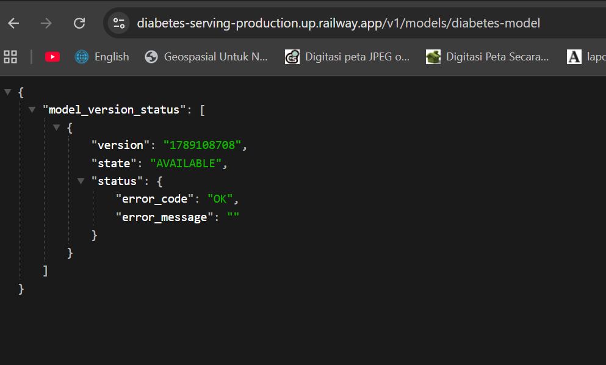
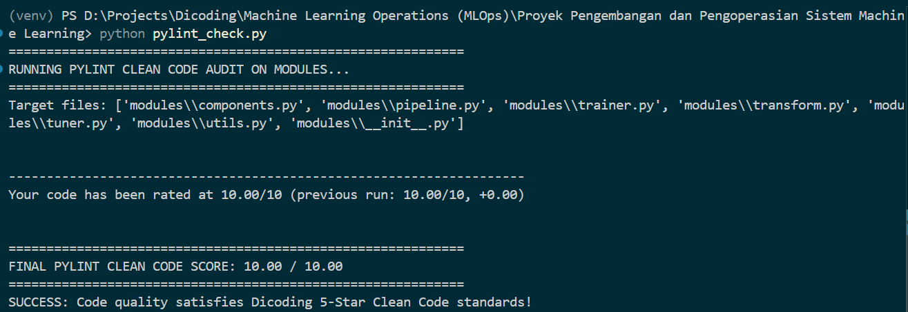
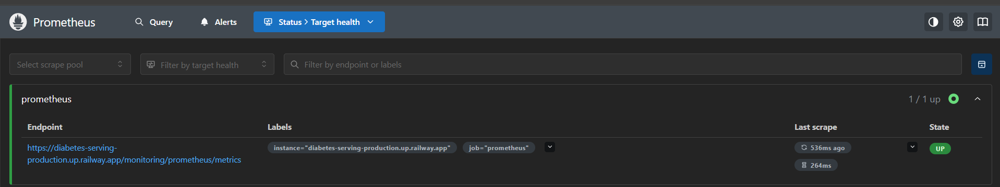
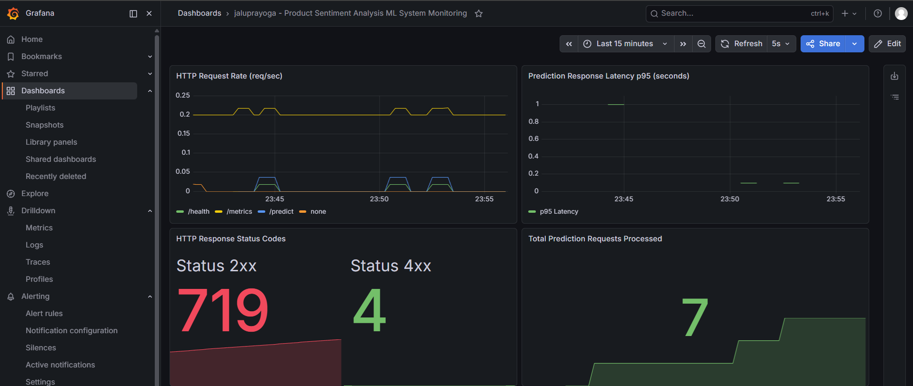

# Submission: Diabetes Prediction TFX Pipeline

Name: Jalu Prayoga

Dicoding Username: jaluprayoga

| Category | Description |
| --- | --- |
| **Dataset** | The dataset used is the **Pima Indians Diabetes Dataset** downloaded directly from the [official GitHub repository (jbrownlee/Datasets)](https://raw.githubusercontent.com/jbrownlee/Datasets/master/pima-indians-diabetes.data.csv).<br><br>**Data Size:** 768 patient medical records (females aged >= 21 years).<br><br>**Number of Features:** 9 columns (8 numerical predictor features + 1 binary target):<br>1. `Pregnancies`: Number of pregnancies<br>2. `Glucose`: 2-hour oral glucose tolerance test plasma glucose concentration<br>3. `BloodPressure`: Diastolic blood pressure (mm Hg)<br>4. `SkinThickness`: Triceps skin fold thickness (mm)<br>5. `Insulin`: 2-hour serum insulin (mu U/ml)<br>6. `BMI`: Body mass index (weight in kg / (height in m)2)<br>7. `DiabetesPedigreeFunction`: Diabetes pedigree function score<br>8. `Age`: Patient age (years)<br>9. `Outcome` *(Target/Label)*: Diabetes status (`0` = Non-Diabetic, `1` = Diabetic) |
| **Problem Statement** | Diabetes is a chronic metabolic disease with serious health risks whose clinical intervention is often delayed because symptoms are frequently asymptomatic in early stages. Automated and accurate early detection through routine physical and laboratory diagnostic measurements (such as glucose, blood pressure, BMI, insulin, age) is vital to prevent fatal complications. |
| **Machine Learning Solution** | Developing an End-to-End Machine Learning pipeline orchestrated by **Apache Beam (`BeamDagRunner`)** based on **TensorFlow Extended (TFX)** utilizing a **Deep Neural Network (Multi-Layer Perceptron / MLP)** architecture integrated with **KerasTuner** for automated hyperparameter optimization, **TensorFlow Transform (TFT)** for consistent feature standardization, automated evaluation validation (**TFMA**), containerized model serving (**TensorFlow Serving / TF Serving**), and real-time observability (**Prometheus & Grafana**).<br><br>**Key Strengths:**<br>1. Effectively captures non-linear relationships across clinical biomarkers.<br>2. Eliminates *training-serving skew* by exporting Z-score normalization graphs directly inside the *SavedModel* artifact.<br>3. Prioritizes **Recall** optimization to minimize life-threatening *False Negatives* (undetected diabetic patients). |
| **Data Preprocessing** | **1. Total Features:** 9 features (8 numerical features + 1 target label `Outcome`).<br>**2. Data Splitting:** `CsvExampleGen` with hash-bucket-based `SplitConfig`: **80% Training Data (`train`)** and **20% Evaluation Data (`eval`)**.<br>**3. Feature Engineering:** The `Transform` component (`modules/transform.py`) applies **Z-Score Scaling** (`tft.scale_to_z_score`) across all 8 numerical features, and type casts the `Outcome` target to `tf.int64`.<br>**4. Preprocessing Rationale:** Clinical biomarker scales vary drastically (e.g., `Insulin` ranges from 0-846 whereas `DiabetesPedigreeFunction` spans 0.078-2.42). Z-score scaling stabilizes gradient updates and accelerates convergence. |
| **Model Architecture** | **1. Layer Structure:**<br>- Input Layer: 8 `tf.keras.Input(shape=(1,))` units for each normalized numerical feature (`_xf`).<br>- Concatenation Layer: Merges all 8 inputs into an 8-dimensional feature vector.<br>- Hidden Layer 1: `Dense(32, activation='relu')` with `Dropout(0.2)` *(tuned from search range 16 to 128)*.<br>- Hidden Layer 2: `Dense(40, activation='relu')` *(tuned from search range 8 to 64)*.<br>- Output Layer: `Dense(1, activation='sigmoid')` for binary risk probability estimation.<br><br>**2. Training Configuration:**<br>- Optimizer: `Adam(learning_rate=0.001)` tuned by KerasTuner (`val_recall` objective).<br>- Loss Function: `BinaryCrossentropy`.<br>- Class Weighting: `{0: 1.0, 1: 2.5}` to address positive class imbalance and prioritize diabetic sensitivity.<br>- Callbacks: `EarlyStopping(monitor='val_loss', mode='min', patience=5, restore_best_weights=True)`. |
| **Evaluation Metrics** | Comprehensive evaluation using **TensorFlow Model Analysis (TFMA)** in the `Evaluator` component:<br>1. **BinaryAccuracy**: Minimum threshold `value_threshold >= 0.60` (60%) and outperforming baseline (`change_threshold` `HIGHER_IS_BETTER`).<br>2. **Recall**: Mandatory threshold `value_threshold >= 0.70` (70%) and better than baseline for model blessing.<br>3. **AUC (Area Under ROC Curve)**: Measures classification discriminative ability.<br>4. **Precision**: Measures accuracy of positive diabetic predictions.<br>5. **BinaryCrossentropy**: Assesses probabilistic loss divergence. |
| **Model Performance** | The model successfully passed all TFMA validation gates (`Accuracy >= 0.60`, `Recall >= 0.70`), earning **BLESSED** status and automatically exported by the `Pusher` component to the `serving_model/` directory.<br>- **Accuracy (BinaryAccuracy):** **68.46%** (Score: 0.6846)<br>- **Recall:** **77.08%** (Score: 0.7708)<br>- **AUC (ROC):** **79.70%** (Score: 0.7970)<br>- **Precision:** **50.68%** (Score: 0.5068)<br>- **Loss:** **0.6168** |
| **Deployment Options** | The trained model achieving **BLESSED** status is exported by the TFX `Pusher` component in *TensorFlow SavedModel* format and served using **TensorFlow Serving (TF Serving)** via the official container image (`tensorflow/serving:latest`). The container is configured with a dynamic entrypoint script to seamlessly bind to cloud environment `$PORT` variables (such as Railway PaaS) and load Prometheus monitoring configuration (`--monitoring_config_file`). Cloud deployment is hosted on the **Railway** PaaS platform with automated CI/CD integrated directly with the GitHub repository. The service exposes `/v1/models/diabetes-model` (model status and metadata probe), `/v1/models/diabetes-model:predict` (REST API inference), and `/monitoring/prometheus/metrics` (Prometheus metrics exporter).<br><br>**Model Serving Links & Endpoints:**<br>- **Model Metadata & Status:** [https://diabetes-serving-production.up.railway.app/v1/models/diabetes-model](https://diabetes-serving-production.up.railway.app/v1/models/diabetes-model)<br>- **Prediction REST API:** [https://diabetes-serving-production.up.railway.app/v1/models/diabetes-model:predict](https://diabetes-serving-production.up.railway.app/v1/models/diabetes-model:predict)<br>- **Prometheus Metrics Endpoint:** [https://diabetes-serving-production.up.railway.app/monitoring/prometheus/metrics](https://diabetes-serving-production.up.railway.app/monitoring/prometheus/metrics) |
| **Monitoring** | Real-time operational observability of the model serving infrastructure is implemented using a **Prometheus** and **Grafana** monitoring stack:<br>1. **Prometheus Scraping:** Periodically pulls TF Serving metrics from the `/monitoring/prometheus/metrics` endpoint every 5 seconds (`monitoring/prometheus.yml`) with external label `monitor: "tf-serving-monitor"`.<br>2. **Monitored Metrics:** TF Serving HTTP request throughput (`:tensorflow:serving:request_count`), inference latency distribution (`:tensorflow:serving:request_latency`), model availability (`:tensorflow:serving:model_version_status`), and execution counters.<br>3. **Monitoring Insights & Results:**<br>- **Availability & Reliability:** Target status is active and reported as `UP` in Prometheus Target Health.<br>- **Interactive Grafana Visualization:** Real-time metrics and system health are monitored on a dedicated Grafana dashboard (`monitoring/grafana-dashboard.json`). |

---

<p align="center">
  
  
  
  
  
  
  
  
  
</p>

## Table of Contents
- [Project Overview](#project-overview)
- [Prerequisites & Environment Requirements](#prerequisites--environment-requirements)
- [Installation](#installation)
  - [1. Clone Repository](#1-clone-repository)
  - [2. Setup Virtual Environment](#2-setup-virtual-environment)
  - [3. Install Dependencies](#3-install-dependencies)
  - [4. Download and Prepare Dataset](#4-download-and-prepare-dataset)
  - [5. Execute the End-to-End TFX Pipeline](#5-execute-the-end-to-end-tfx-pipeline)
  - [6. Run Code Quality Audit (Pylint 10.00/10)](#6-run-code-quality-audit-pylint-100010)
- [Model Serving Options](#model-serving-options)
  - [Option 1: One-Click Full Stack via Docker Compose (Recommended)](#option-1-one-click-full-stack-via-docker-compose-recommended)
  - [Option 2: Standalone TensorFlow Serving via Docker](#option-2-standalone-tensorflow-serving-via-docker)
  - [Option 3: Lightweight FastAPI Serving](#option-3-lightweight-fastapi-serving)
- [API Inference & Testing Examples](#api-inference--testing-examples)
  - [Model Status Inspection](#model-status-inspection)
  - [Prediction via REST API (cURL)](#prediction-via-rest-api-curl)
  - [Prediction via Python Script](#prediction-via-python-script)
  - [Interactive Testing via Jupyter Notebook](#interactive-testing-via-jupyter-notebook)
- [Monitoring & Observability Setup](#monitoring--observability-setup)
- [Visual Proof & Screenshots](#visual-proof--screenshots)


---

## Project Overview

This repository contains a production-grade, end-to-end Machine Learning Operations (MLOps) pipeline for early detection of diabetes risk based on the clinical biomarkers of the **Pima Indians Diabetes Dataset**.

The system is engineered using **TensorFlow Extended (TFX)** orchestrated with **Apache Beam (`BeamDagRunner`)** and incorporates:
- **Zero Training-Serving Skew:** Feature transformation logic (`tft.scale_to_z_score`) is embedded directly inside the exported TensorFlow `SavedModel` graph.
- **Automated Hyperparameter Optimization:** `KerasTuner` explores dense layer units, dropout rates, and learning rates to maximize model sensitivity (`val_recall`).
- **Automated Quality Gate Validation:** `TensorFlow Model Analysis (TFMA)` validates candidate models against strict validation thresholds (`Recall >= 0.70`, `BinaryAccuracy >= 0.60`) before blessing and export.
- **Production Serving:** Containerized deployment with **TensorFlow Serving** and an alternative **FastAPI** REST microservice.
- **Real-time Observability:** Built-in **Prometheus** metrics scraping and a pre-configured **Grafana** dashboard monitoring request throughput, latency, and model availability.

---


## Prerequisites & Environment Requirements

To replicate and run this project seamlessly on another computer:

| Requirement | Supported Version | Notes |
| --- | --- | --- |
| **Operating System** | Linux, macOS, or Windows (WSL2 / native) | Cross-platform compatible |
| **Python** | **Python 3.9 or Python 3.10** *(Recommended: `3.10.x`)* | **Important:** TFX 1.13 and TensorFlow 2.12 require Python <= 3.10. Do not use Python 3.11+ due to Apache Beam constraints. |
| **Docker** *(Optional)* | Docker Desktop 20.10+ / Docker Engine | Required for containerized serving and Docker Compose |
| **Git** | 2.25+ | Required to clone the project |

---

## Installation

### 1. Clone Repository

```bash
git clone https://github.com/<your-username>/diabetes-prediction-mlops.git
cd diabetes-prediction-mlops
```

### 2. Setup Virtual Environment

Ensure you have Python 3.10 installed (`python3.10 --version` or `py -3.10 --version`).

#### On Linux / macOS:
```bash
python3.10 -m venv venv
source venv/bin/activate
```

#### On Windows (PowerShell):
```powershell
py -3.10 -m venv venv
.\venv\Scripts\Activate.ps1
```

*(If PowerShell execution policy restricts scripts, run `Set-ExecutionPolicy -Scope Process -ExecutionPolicy Bypass` first).*

### 3. Install Dependencies

Upgrade packaging tools first, then install the pinned project requirements:

```bash
pip install --upgrade pip "setuptools<70.0.0" wheel
pip install -r requirements.txt
```

### 4. Download and Prepare Dataset

Fetch the validated Pima Indians Diabetes dataset directly from the source repository:

```bash
python download_dataset.py
```
*Output: The dataset will be downloaded and verified at `data/diabetes.csv` (768 records with 9 attributes).*

### 5. Execute the End-to-End TFX Pipeline

Run the complete machine learning pipeline orchestrated by Apache Beam:

```bash
python run_pipeline.py
```

The pipeline executes the following lifecycle automatically:
1. `CsvExampleGen`: Ingests and splits data (80% train / 20% eval).
2. `StatisticsGen` & `SchemaGen`: Computes data statistics and infers schema.
3. `ExampleValidator`: Verifies data integrity and detects anomalies.
4. `Transform`: Scales all 8 numerical features using `tft.scale_to_z_score`.
5. `Tuner`: Performs hyperparameter search via `KerasTuner` to maximize `val_recall`.
6. `Trainer`: Trains the Deep Neural Network with the optimal hyperparameters.
7. `Evaluator`: Evaluates candidate model with `TFMA` metrics gates (`Accuracy >= 0.60`, `Recall >= 0.70`).
8. `Pusher`: Exports the blessed model into `serving_model/` format.

### 6. Run Code Quality Audit (Pylint 10.00/10)

Verify that the codebase satisfies 5-star clean code standards:

```bash
python pylint_check.py
```

Expected result:
```text
============================================================
FINAL PYLINT CLEAN CODE SCORE: 10.00 / 10.00
============================================================
SUCCESS: Code quality satisfies Dicoding 5-Star Clean Code standards!
```

---

## Model Serving Options

### Option 1: One-Click Full Stack via Docker Compose (Recommended)

Start TensorFlow Serving, Prometheus, and Grafana simultaneously:

```bash
docker compose up -d
```

- **TF Serving API:** `http://localhost:8501`
- **Prometheus UI:** `http://localhost:9090`
- **Grafana Dashboard:** `http://localhost:3000` *(Login: `admin` / `admin`)*

To stop all services:
```bash
docker compose down
```

### Option 2: Standalone TensorFlow Serving via Docker

Build and run the official TensorFlow Serving container image:

```bash
# Build the container image
docker build -t diabetes-serving .

# Run container binding port 8501
docker run -d -p 8501:8501 --name diabetes-model-serving diabetes-serving
```

### Option 3: Lightweight FastAPI Serving

If you prefer running a lightweight Python REST API directly:

```bash
cd serving
pip install -r requirements.txt
uvicorn app:app --host 0.0.0.0 --port 8000 --reload
```

Interactive Swagger API Documentation will be available at:
`http://localhost:8000/docs`

---

## API Inference & Testing Examples

### Model Status Inspection

Verify that the model is loaded and in `AVAILABLE` state:

```bash
curl -X GET http://localhost:8501/v1/models/diabetes-model
```

Response:
```json
{
  "model_version_status": [
    {
      "version": "1789238603",
      "state": "AVAILABLE",
      "status": {
        "error_code": "OK",
        "error_message": ""
      }
    }
  ]
}
```

### Prediction via REST API (cURL)

Send sample patient biomarker data for real-time inference:

```bash
curl -X POST http://localhost:8501/v1/models/diabetes-model:predict \
  -H "Content-Type: application/json" \
  -d '{
    "signature_name": "serving_default",
    "instances": [
      {
        "Pregnancies": [6.0],
        "Glucose": [148.0],
        "BloodPressure": [72.0],
        "SkinThickness": [35.0],
        "Insulin": [0.0],
        "BMI": [33.6],
        "DiabetesPedigreeFunction": [0.627],
        "Age": [50.0]
      }
    ]
  }'
```

Response:
```json
{
  "predictions": [
    [0.7708]
  ]
}
```
*(A probability score >= 0.50 denotes Diabetic risk with high recall sensitivity).*

### Prediction via Python Script

```python
import json
import requests

url = "http://localhost:8501/v1/models/diabetes-model:predict"
payload = {
    "signature_name": "serving_default",
    "instances": [
        {
            "Pregnancies": [6.0],
            "Glucose": [148.0],
            "BloodPressure": [72.0],
            "SkinThickness": [35.0],
            "Insulin": [0.0],
            "BMI": [33.6],
            "DiabetesPedigreeFunction": [0.627],
            "Age": [50.0],
        }
    ],
}

response = requests.post(url, json=payload)
result = response.json()
prob = result["predictions"][0][0]
is_diabetic = "Diabetic" if prob >= 0.5 else "Non-Diabetic"

print(f"Prediction: {is_diabetic} (Probability: {prob:.4f})")
```

### Interactive Testing via Jupyter Notebook

Open and run `jaluprayoga-testing.ipynb` to execute test suites for both local endpoints and live cloud endpoints:

```bash
jupyter notebook jaluprayoga-testing.ipynb
```

---

## Monitoring & Observability Setup

1. **Prometheus Metrics Endpoint:**
   TensorFlow Serving natively exposes Prometheus metrics at:
   `http://localhost:8501/monitoring/prometheus/metrics`

2. **Prometheus Server:**
   Prometheus automatically scrapes metrics every 5 seconds as defined in `monitoring/prometheus.yml`. Check scraper health at `http://localhost:9090/targets`.

3. **Grafana Dashboard:**
   - Open Grafana at `http://localhost:3000` (User: `admin`, Password: `admin`).
   - Add Prometheus as a Data Source with URL `http://prometheus:9090` (or `http://localhost:9090`).
   - Go to **Dashboards -> Import** and upload `monitoring/grafana-dashboard.json`.
   - View real-time panels for HTTP throughput, request latency, and model availability.

---

## Visual Proof & Screenshots

### 1. Cloud Model Deployment (Railway)


### 2. Pylint 10.00/10 Clean Code Audit


### 3. Prometheus Target Health (UP)


### 4. Real-time Grafana Observability Dashboard


---
